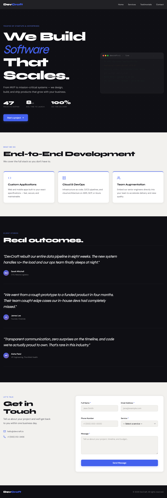

# DevCraft

A static marketing landing page for **DevCraft** — a software development agency targeting technical buyers (CTOs, founders, VP Engineering).

## Live Site

[https://piercequek-sys.github.io/softwaredevelopment/](https://piercequek-sys.github.io/softwaredevelopment/)

## Screenshot



## Design

Built using the `frontend-design` skill with a project-specific direction:

- **Typography:** Syne (display/headings) + DM Sans (body) — editorial and distinctive
- **Palette:** Ink `#0F0F14` · Canvas `#F2F1EE` · Indigo accent `#4361EE`
- **Signature element:** Animated CI/CD build ticker in the hero — immediately credible to technical buyers
- **Section rhythm:** Dark hero → Light services → Dark testimonials → Light contact

## Tech Stack

Pure HTML, CSS, and JavaScript — no frameworks or build tools.

## File Structure

```
├── index.html          # Single-page layout: Nav, Hero, Services, Testimonials, Contact, Footer
├── styles.css          # All styles — CSS custom properties, mobile-first, BEM naming
├── script.js           # Build ticker animation, form validation, WhatsApp widget, nav, scroll reveal
├── favicon.svg         # SVG favicon
├── robots.txt          # Search crawler rules
├── sitemap.xml         # XML sitemap for SEO
├── screenshot.png      # Full-page site screenshot
└── .claude/skills/
    └── frontend-design.md  # Project-specific design skill (DevCraft edition)
```

## Running Locally

Serve locally to avoid font/CORS quirks:
```bash
python3 -m http.server 8080
```

Then open [http://localhost:8080](http://localhost:8080).

## Deployment

Deployed automatically to GitHub Pages via GitHub Actions on every push to `main`.
